# Wallet Discovery Architecture

## Product Boundary

This repository discovers and ranks Polymarket wallets for research. Its output is a current,
evidence-backed L0-L6 wallet list. It does not execute downstream trading, order submission,
settlement, or publication to another system.

Historical migration files remain so an existing SQLite database can be upgraded in place. The
final research-only migration removes their retired runtime tables; they are not authorities for
the L0-L6 funnel.

## End-to-End Flow

```mermaid
flowchart LR
    A["Polymarket sources"] --> B["wallet_sightings"]
    B --> C["L0 observed"]
    C -->|trusted source or observed sample >= 100 USDC| D["L1 admitted"]
    D --> E["recent 10-trade screen"]
    E -->|sample volume >= 100 USDC| F["L2 screened"]
    F --> G["light history <= 200 rows"]
    G -->|evidence floor + relative rank| H["L3 promising"]
    H --> I["deep history <= 1000 rows"]
    I -->|evidence floor + relative rank| J["L4 strong"]
    J -->|stronger floor + relative rank| K["L5 scoring elite"]
    K -->|current deep evidence| L["independent profit, persistence, anomaly validation"]
    L -->|pass only| M["L6 independently verified"]
    L -->|warning or fail| K
```

There is no absolute score that declares a wallet universally good. A wallet must first have enough
evidence to be comparable, then it competes against wallets with comparable source and strategy
profiles. This prevents a fixed threshold from making the system permanently empty while also
preventing very thin histories from promoting each other.

## Level Contract

| Level | Meaning | Required work | Storage cost |
| --- | --- | --- | --- |
| L0 | A syntactically valid address observed from a source | Provenance and compact recent sightings only | Very low |
| L1 | Trusted source, or up to 10 verified observed trades total at least 100 USDC | Fetch at most 10 recent trades | Very low |
| L2 | Recent sample contains at least one trade and at least 100 USDC total volume | Fetch light history and bounded PnL evidence | Low |
| L3 | Light evidence passed the L3 floor and relative-rank selection | Fetch deep history | Medium |
| L4 | Deep evidence passed the L4 floor and relative-rank selection | Reuse and refresh deep evidence | Medium |
| L5 | Deep evidence passed the strongest floor and relative-rank selection | Wait for or refresh independent validation | Medium |
| L6 | The current L5 evidence also passed independent profit, persistence, and anomaly validation | Revalidate independently every 14 days or after evidence changes | Medium |

Levels are monotonic research achievements. They do not bounce downward because of one short-term
sample. L5 remains the highest result produced by the scoring and relative-ranking system. A current
elite wallet is stricter than merely having `level = l5` or `level = l6`: health and UI exposure also
require a recent deep summary, the current summary methodology, no hard risk block, and a selected L5
decision for the same active artifact under the current selection policy.

L6 does not rescore or replace L5. It is a separate verification achievement. A currently verified
L6 additionally requires a recent passing validation for the same active deep artifact. Warning or
fail leaves an L5 wallet at L5. A historical L6 is not automatically demoted, but it is no longer
presented as currently verified when its validation is stale or its deep artifact has changed.

## Admission and Validation

### Single ingress

`orchestration/wallet_sightings.py` is the only source boundary. Leaderboards, public activity,
RTDS, curated CSV files, and Polydata imports call it. It validates and normalizes EVM addresses,
records provenance in `observed_wallets`, and creates the canonical `wallet_levels` row.

Health enforces this boundary as a data invariant: every candidate must have an observation and a
level, and every observation must have a level. Migration 65 repairs candidates imported by older
runtimes before this single-ingress contract existed.

L0 to L1 is intentionally cheap:

- a curated or otherwise trusted source is enough;
- otherwise, the compact sample of up to 10 verified observed trades must total at least 100 USDC;
- an unverified address remains L0.

Ingress never fetches full history and never scores a wallet.

### L1 recent screen

`orchestration/wallet_screening.py` fetches at most 10 recent public trades. The only promotion gate
is total sampled volume of at least 100 USDC. A failed screen is not retried continuously. It may be
screened again after seven days only when a newer source sighting exists.

This gate is cheap by design. It removes dormant and dust-only addresses without requiring market
diversity, ROI, strategy labels, or long history before the project knows whether the wallet is
economically active.

### History evidence and score

`orchestration/wallet_history_pipeline.py` fetches only the depth authorized by the current level:

- L2: light history, up to 200 activity rows;
- L3-L6: deep history, up to 1,000 activity rows;
- light PnL: up to 50 closed positions;
- deep PnL: paginated up to 500 closed positions.

`research/wallet_history_summary.py` produces a strategy-neutral score from PnL, estimated ROI,
market breadth, activity, persistence, and concentration. Missing ROI is weak evidence, not a
neutral return. Strategy tags describe behavior; they are not automatic rejection rules. Risk flags
remain visible research facts unless an explicit, independently justified hard-risk rule is set.

### Relative selection

`orchestration/wallet_level_selection.py` applies evidence floors before ranking:

| Transition | Required depth | Activity | Markets | Volume | Bucket share | Global baseline |
| --- | --- | ---: | ---: | ---: | ---: | ---: |
| L2 -> L3 | light | 10 | 1 | 100 USDC | top 25% | none; L3 allocates bounded deep research |
| L3 -> L4 | deep | 50 | 3 | 500 USDC | top 20% | top 50% globally |
| L4 -> L5 | deep | 100 | 5 | 1,000 USDC | top 10% | top 25% globally |

The default cohort needs 20 comparable wallets. After one hour, a cohort of at least five may be
processed so sparse sources do not wait forever. Selection is balanced across sufficiently populated
source and strategy buckets, with source-wide and global fallbacks for small buckets. Promotion caps
bound each control pass to 12 new L3, 6 new L4, and 2 new L5 promotions by default. L4 and L5 must
also clear their global relative baseline, so the best wallet in a weak isolated bucket cannot become
a strong or elite wallet solely through bucket fairness.

Selection policy `relative_rank_v3` also retains the latest score snapshot previously evaluated for
the same transition and policy. A late wallet therefore competes with the established transition
benchmark instead of being promoted merely because it arrived in a tiny new process-local batch.
Current evidence replaces an older snapshot for the same wallet.

The deployed selection policy version is code-owned. NAS and systemd services do not override it
through environment variables; a policy change requires a reviewed code/version update and fresh
selection decisions.

Do not add a second fixed quality threshold on top of these relative ranks without measured false
positive and false negative data. Hard evidence floors answer "is this comparison meaningful";
relative rank answers "which wallets deserve the next unit of research work".

### Independent L6 validation

`orchestration/l6_validation_pipeline.py` queues only current L5/L6 wallets. It fetches a separate,
bounded 90-day evidence set plus official WEEK/MONTH/ALL leaderboard cross-checks.
`research/l6_validation.py` evaluates four questions without using the wallet's research score:

- profit: realized PnL must be positive and recent 30-day realized PnL must not be negative;
- persistence: at least 10 timestamped closed positions, four active weeks, 90% timestamp coverage,
  and at least half of active weeks profitable;
- anomaly risk: no extreme single-market or single-day profit concentration and no realized
  drawdown larger than total positive realized PnL.
- official contradiction: official all-time PnL must be positive. Official PnL divided by official
  cumulative volume is stored as profit intensity, never as account ROI; a positive value below
  0.2% produces a review warning rather than a false failure.

Incomplete source pagination, thin history, missing official cross-checks, weak official profit
intensity, or weak timestamp coverage produces `warning`, not a false failure. Activity anomalies
such as mechanical timing, extreme bursts, or high turnover with
little net flow are retained as visible flags. Only a complete `pass` advances L5 to L6. This module
does not use paper results, copyability, maker/taker roles, or any execution signal.

## Queue Contract

`pipeline_jobs` is a bounded work queue, not wallet truth. Only three production job types are active:

- `wallet_recent_screen`: bounded L1 screen;
- `wallet_history_collect`: light or deep history authorized by `wallet_levels`;
- `wallet_l6_validate`: low-volume independent validation for current L5/L6 wallets.

`pipeline_jobs.job_scope` is a bounded fetch scope such as `sample`, `light`, or `deep`; it is not
the wallet's L level. `pipeline_jobs.job_action` is the immutable action/deduplication key. The
canonical wallet level is always `wallet_levels.level`.

Planners cap queued plus running jobs and exclude exhausted queued jobs from active waterlines.
History candidate limits are applied independently to light and deep work before source-aware
rotation, so one depth cannot disappear during SQL truncation. Workers lease jobs by stable wallet
shard, perform network requests outside long SQLite write transactions, and commit compact results.
Jobs waiting more than one hour age ahead of normal priority. Expired leases and exhausted jobs are
recovered by maintenance.

## Storage Contract

### SQLite control plane

SQLite stores small mutable state:

- `observed_wallets`: provenance and the compact recent sample;
- `candidate_wallets`: admitted-wallet metadata retained for database compatibility;
- `wallet_levels` and `wallet_level_events`: canonical level and audit trail;
- `wallet_screen_summaries`: L1 screen result;
- `wallet_pnl_summaries`: bounded PnL/ROI estimate and coverage;
- `wallet_history_summaries`: current compact research facts and score;
- `wallet_level_selections`: policy-versioned rank decisions;
- `wallet_l6_validations`: compact policy-versioned independent-validation verdicts and metrics;
- `wallet_history_artifacts`: Parquet catalog and lifecycle state;
- `pipeline_jobs`: bounded worker leases;
- runtime heartbeats and API-rate state.

SQLite must not become the long-term raw trade warehouse.

### Parquet evidence plane

Raw light and deep wallet histories are written directly to versioned Parquet files under the
configured archive root. L6 source rows are written separately under the versioned `l6_validation`
tree. Files are written and verified before their compact SQLite metadata is committed; wallet-history
catalog switches also mark the previous active history artifact as `superseded`.

GC is conservative:

- active artifacts are never selected;
- superseded artifacts must exceed the configured age;
- the newest configured number of superseded artifacts per wallet is retained;
- paths outside the archive root, parent traversal, absolute paths, and symlinks are rejected;
- deleted catalog rows are retained as tombstones with `purged_at` for auditability.

Deletion is two-phase: `purge_started_at` is committed before unlinking the verified file, then
`purged_at` is committed after deletion. If the process stops between those steps, the next GC pass
finishes the pending purge instead of misclassifying the missing file as unexplained catalog drift.

Before GC, NAS maintenance audits every unpurged catalog path for existence and byte size, rejects
unsafe paths, and scans the wallet-history tree for uncatalogued Parquet files. Orphans younger than
seven days are left alone so an in-flight write is never collected; bounded older orphans may be
removed. Full SHA-256 verification is an explicit slower mode rather than a 15-minute maintenance
default.

The default keeps one superseded artifact and waits 30 days. A dry run is the CLI default; NAS
maintenance uses the explicit execute flag.

### Refresh policy

Evidence is refreshed when the summary methodology changes, or when there is a newer real wallet
sighting than the current summary after the normal refresh window:

- any summary written by an older methodology: immediately, with L6 through L2 processed in that
  order;

- failed L1 screen: no sooner than seven days;
- L2 light history: no sooner than 30 days;
- L3-L6 deep history: no sooner than seven days;
- L6 independent validation: every 14 days, or immediately after the active deep artifact changes.

Level transitions do not update `last_seen_at`; otherwise internal processing would manufacture a
false market sighting and create an endless refresh loop.

## Runtime Ownership

| Module | Responsibility | Validation boundary | Main pitfall |
| --- | --- | --- | --- |
| `wallet_sightings.py` | Normalize all source events and admit L0/L1 | EVM address, verified/trusted source | Never fetch history or score here |
| `wallet_screening.py` | Plan and execute the 10-trade screen | Current level, hard block, sample volume | Do not turn source labels into quality gates |
| `wallet_history_pipeline.py` | Plan depth-limited fetches and persist summaries/artifacts | Level-authorized depth, lease ownership, refresh age | Do not store fetched raw rows back in SQLite |
| `wallet_history_summary.py` | Derive versioned comparable facts | Row normalization and bounded components | Strategy labels are descriptions, not exclusions |
| `wallet_level_selection.py` | Allocate deeper work by evidence floor and relative rank | Depth, minimum evidence, cohort readiness | Do not rank thin rows or promote twice in one pass |
| `l6_validation_pipeline.py` | Plan and execute low-volume independent validation | Current L5 selection, active artifact, lease ownership | Warning/fail must not demote or promote a wallet |
| `l6_validation.py` | Derive profit, persistence, and anomaly verdicts | Complete evidence before hard conclusions | Do not reuse the relative research score as proof |
| `wallet_history_store.py` | Atomic Parquet lifecycle and GC | Checksum/readback, path containment, one active artifact | Never delete an active or unverified path |
| `l6_validation_store.py` | Persist immutable raw L6 source rows | Checksum/readback and relative path containment | Never expose host-absolute paths in metadata |
| `storage/wallet_levels.py` | Canonical monotonic level/event writes | Address and legal transition | Do not use queue state or legacy stages as authority |
| `ops.py` | Health, backup, bounded SQLite maintenance | Schema/readiness and safe cleanup | SQLite backup alone is not a Parquet backup |
| `web.py` | Read-only research console | Current L5 and verified-L6 freshness contracts | Do not present historical L5/L6 as current evidence |

Runtime health uses a 15-minute default freshness window for continuous and short-interval loops.
Hourly leaderboard and activity discovery use a two-hour override, so health reflects the deployed
schedule instead of reporting a false outage while those loops are sleeping normally.

## Recovery and Long-Term Maintenance

1. Back up the SQLite database and Parquet archive as one logical dataset. SQLite contains the
   catalog; Parquet contains the raw evidence. Either half alone is incomplete.
2. Run migrations before starting workers.
3. Keep raw source inputs replayable when possible. Replaying sightings is safe because ingress and
   job admission are idempotent.
4. Preserve methodology, storage, and selection policy versions. New policies write new decisions;
   they do not silently reinterpret old rows.
5. Use bounded maintenance and passive WAL checkpoints during normal operation. Reserve VACUUM and
   full filesystem snapshots for a controlled maintenance window.
6. Treat missing catalog files, orphan Parquet files, and checksum mismatches as health failures to
   repair before GC or restore operations.

## Compatibility Boundary

Old migration files retain the pre-research upgrade history. Migration 62 collapses the resulting
database into the current research-only schema and drops every retired runtime table. Runtime code,
health, web views, and L0-L6 transitions must use only the compact schema listed above.

Do not add new writes or compatibility aliases for retired lifecycles. Any future schema evolution
must preserve the research-only boundary and use a forward migration.
